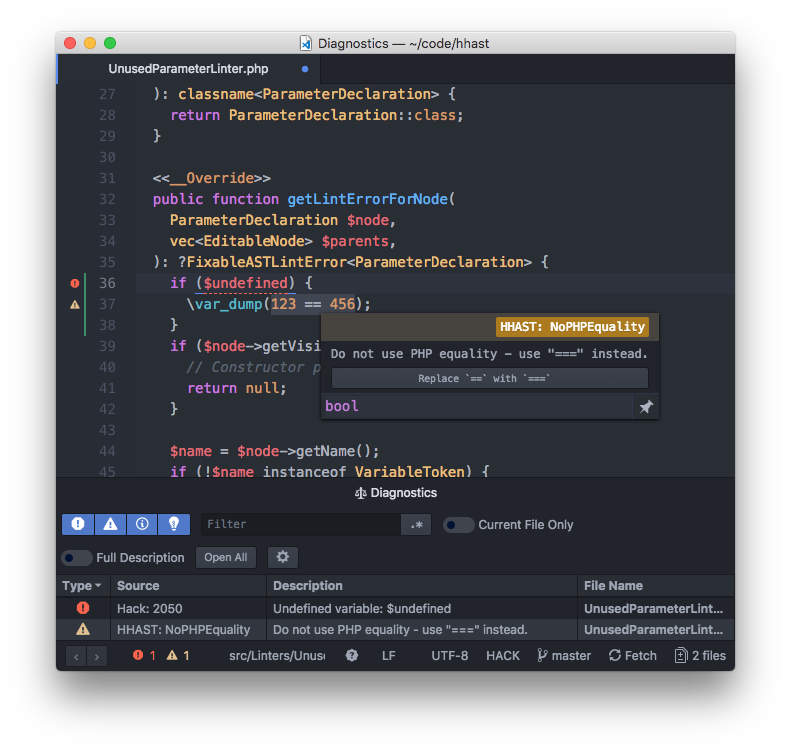

# atom-ide-hhast

[HHAST](https://github.com/hhvm/hhast) provides a linter for Hack code; this
package provides IDE integration for [Atom IDE](https://ide.atom.io) and
[Nuclide](https://nuclide.io).

This consists of error reporting and providing fix actions for some linters.

## Examples

## Requirements

* HHAST 3.27.2 or newer
* HHVM 3.27.1 or newer
* Atom
* Either a recent version of Nuclide, or `atom-ide-ui`

## Building `atom-ide-hhast`

No build process is required; pure ES6 is used, which Atom natively understands

## Installing `atom-ide-hhast`

Atom IDE
--------

Install the `ide-hhast` and `atom-ide-ui` packages through the Atom UI, or run `apm install ide-hhast atom-ide-ui`.

Nuclide
-------

Install the `ide-hhast` package through the Atom UI, or run `apm install ide-hhast`.

## How `atom-ide-hhast` works

HHAST's linter supports the [Language Server Protocol](https://microsoft.github.io/language-server-protocol/specification);
this plugin simply starts an LSP client.

## Join the HHAST community

* Facebook page: https://www.facebook.com/groups/hhvm.general/
* irc: #hhvm on irc.freenode.net
* Twitter: https://twitter.com/hacklang

See the CONTRIBUTING file for how to help out.

## License
atom-ide-hhast is MIT licensed, as found in the LICENSE file.
